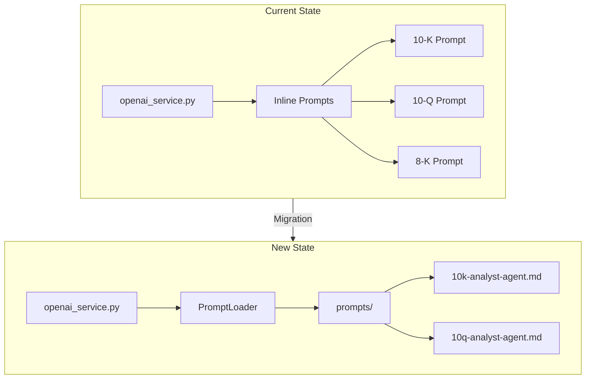

# Remove 8-K Support and Implement New Master Prompts

## Architecture Overview

---

## Part 1: Create Prompt Infrastructure

### 1.1 Create prompts directory and add master prompt files

Create `backend/prompts/` directory with:

- `10k-analyst-agent.md` - Copy from your Downloads
- `10q-analyst-agent.md` - Copy from your Downloads

### 1.2 Create prompt loader utility

Create `backend/app/services/prompt_loader.py`:

- Load markdown files at module import (cached)
- Parse prompts into system message and user prompt components
- Provide `get_prompt(filing_type: str)` function

---

## Part 2: Remove 8-K References

### 2.1 Backend - Core Services

**[backend/app/services/openai_service.py](backend/app/services/openai_service.py)**

- Line 197: Remove `"8-K": "gemini-2.0-flash"` from model overrides
- Lines 263-279: Remove entire 8-K configuration block from `_get_type_config()`
- Lines 387-398: Remove `elif filing_type_key == "8-K":` branch in `extract_critical_sections()`
- Lines 1458-1461: Remove 8-K focus guidance
- Lines 1961-1964: Remove duplicate 8-K focus guidance
- Line 2000: Remove 8-K comment in prompt
- Replace inline prompts with calls to new `prompt_loader`

**[backend/app/services/sec_edgar.py](backend/app/services/sec_edgar.py)**

- Line 153: Change default `filing_types: List[str] = ["10-K", "10-Q", "8-K"]` to `["10-K", "10-Q"]`

**[backend/app/services/hot_filings.py](backend/app/services/hot_filings.py)**

- Lines 231-232: Remove `elif filing.filing_type.upper() == "8-K":` case and bonus

### 2.2 Backend - Routers

**[backend/app/routers/summaries.py](backend/app/routers/summaries.py)**

- Lines 242-249: Remove `elif filing_type == "8-K":` processing profile block

**[backend/app/routers/filings.py](backend/app/routers/filings.py)**

- Line 88: Change `types_list = ["10-K", "10-Q", "8-K"]` to `["10-K", "10-Q"]`

### 2.3 Backend - Data Schema

**[backend/pipeline/schema.py](backend/pipeline/schema.py)**

- Line 51: Change `filing_type: Literal["10-Q", "10-K", "8-K"]` to `Literal["10-Q", "10-K"]`

### 2.4 Frontend

**[frontend/app/company/[ticker]/page-client.tsx](frontend/app/company/[ticker]/page-client.tsx)**

- Line 175: Remove `case '8-K':` from styling switch
- Lines 300-307: Remove 8-K filter button entirely
- Update filter type state to only allow `'10-K' | '10-Q' | null`

---

## Part 3: Integrate New Prompts into openai_service.py

### 3.1 Refactor prompt generation

The current code has prompts embedded at multiple locations:

- `generate_structured_summary()` (Lines 1573-1599, 1622-1627)
- `summarize_filing_stream()` (Lines 1993-2102, 2115)
- `generate_editorial_summary()` (Lines 1717-1785)

**Strategy:**

- Import the new `prompt_loader` module
- Replace the inline `focus_guidance` dict with loaded prompts
- Map the markdown sections to the appropriate method calls
- The new prompts define both the system message and the output schema

### 3.2 Prompt mapping

| Current Component | New Source (10-K) | New Source (10-Q) |

|-------------------|-------------------|-------------------|

| System message | Role Definition section | ROLE section |

| Extraction logic | Extraction Workflow | PHASE 1-2 |

| Output schema | Output Template | PHASE 4 template |

| Risk analysis | Step 4 rules | PHASE 3 Red Flags |

---

## Part 4: Update Documentation

Remove 8-K mentions from:

- [EarningsNerd_Development_Plan.md](EarningsNerd_Development_Plan.md) (Line 293)
- [.claude/agents/README.md](.claude/agents/README.md) (Line 172)
- [.claude/agents/testing/integration-tester.md](.claude/agents/testing/integration-tester.md) (Line 164)
- [.claude/agents/marketing/seo-optimizer.md](.claude/agents/marketing/seo-optimizer.md) (Line 190)
- [.claude/agents/marketing/content-writer.md](.claude/agents/marketing/content-writer.md) (Line 182)
- [.claude/agents/product/trend-researcher.md](.claude/agents/product/trend-researcher.md) (Line 60)
- [.claude/agents/engineering/ai-engineer.md](.claude/agents/engineering/ai-engineer.md) (Line 16)
- [.claude/agents/engineering/backend-developer.md](.claude/agents/engineering/backend-developer.md) (Line 72)

---

## Part 5: Testing

- Update any tests that reference 8-K filings
- Verify 10-K and 10-Q analysis still works with new prompts
- Test that 8-K requests are properly rejected or handled

---

## File Summary

| Action | Files |

|--------|-------|

| **Create** | `backend/prompts/10k-analyst-agent.md`, `backend/prompts/10q-analyst-agent.md`, `backend/app/services/prompt_loader.py` |

| **Major Edit** | `backend/app/services/openai_service.py` |

| **Minor Edit** | 6 backend files, 1 frontend file |

| **Doc Update** | 8 markdown files |